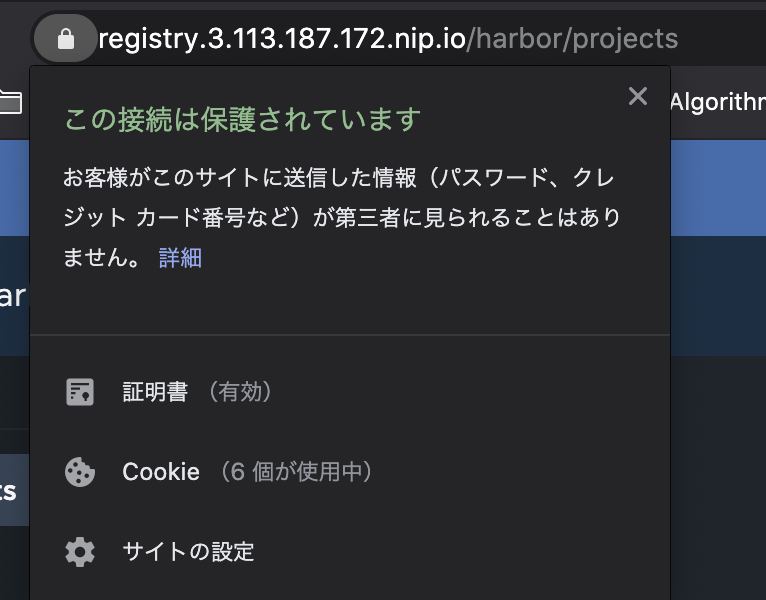

# AWS

## Prerequisites

- Kubernetes: v1.17 or later
- Helm: v3.1.0 or later

## Environment

- Amazon EKS v1.18

## Try with HTTP

Ingress Controller をインストールします。

```sh
helm repo update
helm install ingress bitnami/contour -n contour --version 4.1.3 --create-namespace
```

既に contour に該当する CRD が存在している場合、削除してから再実行してください。

```sh
Error: rendered manifests contain a resource that already exists. Unable to continue with install: CustomResourceDefinition "httpproxies.projectcontour.io" in namespace "" exists and cannot be imported into the current release: invalid ownership metadata; label validation error: missing key "app.kubernetes.io/managed-by": must be set to "Helm"; annotation validation error: missing key "meta.helm.sh/release-name": must be set to "ingress"; annotation validation error: missing key "meta.helm.sh/release-namespace": must be set to "contour"

$ kubectl get crd | grep contour
httpproxies.projectcontour.io                 2021-02-04T17:48:00Z
tlscertificatedelegations.projectcontour.io   2021-02-04T17:48:00Z

$ kubectl delete crd httpproxies.projectcontour.io
$ kubectl delete crd tlscertificatedelegations.projectcontour.io
$ helm install ingress bitnami/contour -n contour --version 4.1.3 --create-namespace
```

1分ぐらい待つと、該当する IP が返却されます。それを `DOMAIN` っていう環境変数に設定します。今回は `nip.io` っていう無料 Wildcard DNS サービスを使って試します。

```sh
IP=$(kubectl describe svc ingress-contour-envoy --namespace contour | grep Ingress | awk '{print $3}')
$ host $IP
xxx.ap-northeast-1.elb.amazonaws.com has address 123.123.123.123
xxx.ap-northeast-1.elb.amazonaws.com has address 234.234.234.234
$ export DOMAIN=123.123.123.123.nip.io
```

次は TLS 認証を自動発行してくれる Cert Manager をインストールします。

```sh
helm install cert-manager jetstack/cert-manager -n cert-manager \
   --version 1.1.1 --set installCRDs=true --create-namespace
```

`cluster-issuer-staging.yaml` の `EMAIL` を適当に変換し HTTP 向けの ClusterIssuer を追加します。

```sh
kubectl apply -f cluster-issuer-staging.yaml
```

`harbor-values-staging.yaml` の `DOMAIN` を先ほど設定したやつに変換してから実行します。

```sh
helm install harbor bitnami/harbor -f harbor-values-staging.yaml -n harbor \
   --version 9.6.1 --create-namespace
```

ブラウザで開いてみましょう。

```sh
open https://registry.$DOMAIN
```

## Try with HTTPS

`cluster-issuer-prod.yaml` の `EMAIL` を適当に変換し HTTPS 向けの ClusterIssuer を追加します。

```sh
kubectl apply -f cluster-issuer-prod.yaml
```

一応、デプロイされているリソースを消します。`helm delete` は PVC リソースは対象外なので、データは欠損されません。
`harbor-values-prod.yaml` の `DOMAIN` を先ほど設定したやつに変換してから実行します。

```sh
helm delete -n harbor harbor
helm install harbor bitnami/harbor -f harbor-values-prod.yaml -n harbor --version 9.6.1
```

ブラウザで開いてみましょう。

```sh
open https://registry.$DOMAIN
```

ご覧の通り HTTPS が有効になっていることが分かります。



## Container Images

docker login を行います。

```sh
$ docker login registry.$DOMAIN
Username: admin
Password:
Login Succeeded
```

適当なコンテナイメージに tag を生成し、Harbor にプッシュします。

```sh
$ docker tag busybox registry.$DOMAIN/library/busybox:1
$ docker push registry.$DOMAIN/library/busybox:1
```
