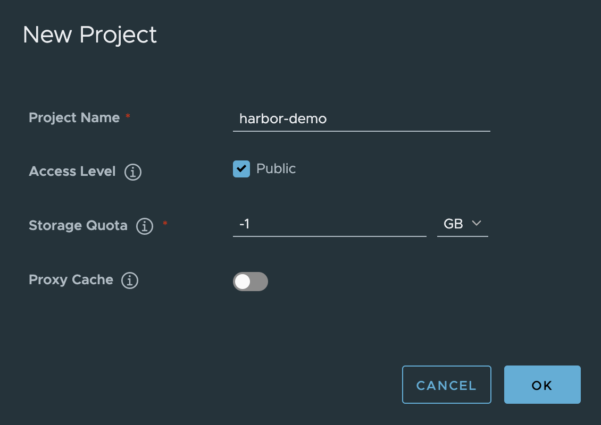

# Local

## Prerequisites

- Docker Engine: v17.06.0-ce or later
- Docker Compose: v1.18.0 or later

## Environment

- macOS (Catalina)

## Try with HTTP

GitHub Releases から Harbor v2.2 オンラインインストールのパッケージをダウンロードします。

```sh
curl -s -Lo ./harbor-online-installer.tgz https://github.com/goharbor/harbor/releases/download/v2.2.0/harbor-online-installer-v2.2.0.tgz
```

圧縮を解除します。

```sh
tar xvf harbor-online-installer.tgz
```

解除されたフォルダに入って、`harbor.yml` をコピーします。

```sh
cd harbor
cp harbor.yml.tmpl harbor.yml
```

`harbor.yml` の中身を少し変更します。

```sh
$ diff harbor.yml.tmpl harbor.yml
5c5
< hostname: reg.mydomain.com
---
> hostname: core.harbor.domain
15c15
<   port: 443
---
>   #port: 443
17,18c17,18
<   certificate: /your/certificate/path
<   private_key: /your/private/key/path
---
>   #certificate: /your/certificate/path
>   #private_key: /your/private/key/path
47c47
< data_volume: /data
---
> data_volume: /tmp/harbor/data
120c120
<     location: /var/log/harbor
---
>     location: /tmp/harbor/logs
198,201c198,201
< # metric:
< #   enabled: false
< #   port: 9090
< #   path: /metrics
---
> metric:
>   enabled: true
>   port: 9090
>   path: /metrics
```

`/etc/hosts` に `hostname` に設定したやつを登録します。

```sh
$ cat /etc/hosts | grep harbor
# harbor
127.0.0.1 core.harbor.domain
```

セットアップスクリプトを実行します。`--with-xxx` オプションでアドオンできるコンポーネントがあるので、気になる方は `install.sh` をご覧ください。

```sh
$ ./install.sh --with-trivy

[Step 0]: checking if docker is installed ...

Note: docker version: 19.03.13

[Step 1]: checking docker-compose is installed ...

Note: docker-compose version: 1.27.4

[Step 2]: preparing environment ...

[Step 3]: preparing harbor configs ...

[Step 4]: starting Harbor ...
Creating network "harbor_harbor" with the default driver
Creating harbor-log ... done
Creating redis         ... done
Creating registryctl   ... done
Creating harbor-db     ... done
Creating harbor-portal ... done
Creating registry      ... done
Creating trivy-adapter ... done
Creating harbor-core   ... done
Creating nginx             ... done
Creating harbor-exporter   ... done
Creating harbor-jobservice ... done
✔ ----Harbor has been installed and started successfully.----
```

ブラウザで開いてみましょう。

```sh
open http://core.harbor.domain
```

- Username: `admin`
- Password: `Harbor12345`

Project を作成します。



## Container Images

docker login を行います。

```sh
# User の場合
$ docker login -u admin -p Harbor12345 http://core.harbor.domain

# Robot Account の場合
$ docker login -u robot$ROBOT_ACCOUNT_NAME -p ROBOT_ACCOUNT_TOKEN http://core.harbor.domain
```

適当なコンテナイメージに tag を生成し、Harbor にプッシュします。

```sh
$ docker tag busybox core.harbor.domain/harbor-demo/busybox:1
$ docker push core.harbor.domain/harbor-demo/busybox:1
```

## Try with HTTPS

TBD
